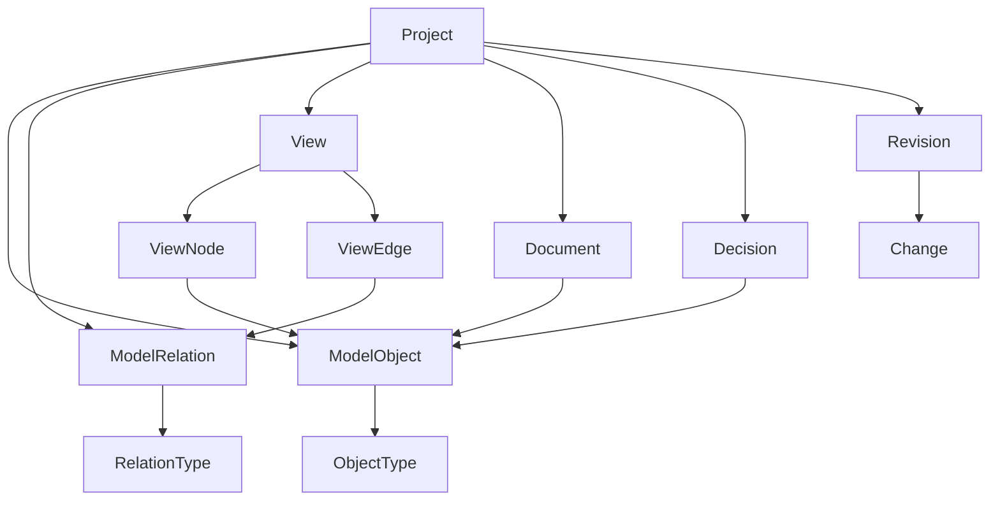

# Archon: семантическое ядро, views и storage-модель

Статус: согласованный архитектурный план.

Дата фиксации: 2026-05-13.

Цель документа: зафиксировать направление развития Archon как инструмента проектирования информационных систем, документирования решений и генерации инженерных артефактов.

## 1. Продуктовая рамка

Archon не строится как универсальная замена всем продуктам на рынке.

Практическая цель:

- проектировать информационные системы для своей команды;
- описывать систему словами, объектами, связями и диаграммами;
- получать техническое задание, понятное команде;
- поддерживать актуальную документацию по версии системы;
- генерировать инженерные артефакты: DDL, OpenAPI, JSON Schema, BPMN, диаграммы и документы;
- подключить MCP-сервер, чтобы чат-ассистент мог создавать и менять модель через команды продукта.

Минимальный продуктовый объем:

- доменная модель;
- диаграмма классов;
- ERD и связи сущностей;
- типы данных;
- структура хранения;
- JSON Schema;
- enum-типы;
- экспорт в PostgreSQL DDL;
- диаграммы процессов;
- BPMN;
- функциональное проектирование в стиле IDEF: узлы, входы, выходы, управление, документы, регламенты;
- общие концепт-схемы;
- sequence diagrams;
- компоненты архитектуры;
- архитектурная карта по доменам;
- OpenAPI-контракты для функций и передаваемых объектов;
- документы, ADR/решения, требования и заметки.

## 2. Главный принцип

Archon не должен хранить диаграммы как источник истины.

Правильная модель:

```text
System Model = Objects + Relations + Properties + Views + Decisions + Revisions
```

Где:

- Objects - смысловые объекты моделируемой системы.
- Relations - типизированные связи между объектами.
- Properties - характеристики объектов и связей.
- Views - способы посмотреть на модель.
- Decisions - архитектурные и продуктовые решения.
- Revisions - история изменений модели.

Диаграмма, документ, таблица, OpenAPI-спека, BPMN-схема - это не отдельные источники истины. Это разные представления одной модели.

Рабочий критерий:

> Если удалить diagram/view, знание о системе не должно исчезнуть. Если из модели можно пересобрать диаграмму, semantic core работает правильно.

## 3. Главная архитектурная идея

Не нужно создавать отдельную SQL-таблицу под каждый тип объекта: `entities`, `processes`, `events`, `api_contracts`, `state_machines`, `components`, `tables`, `fields`, `columns` и так далее.

Такой путь быстро приведет к жесткой схеме, которую сложно расширять.

Целевая модель:

```text
Typed Object Graph + JSONB properties + специализированные таблицы только для критичных случаев
```

Ядро системы хранится как универсальный граф:

- `model_objects`;
- `model_relations`;
- `views`;
- `view_nodes`;
- `view_edges`;
- `documents`;
- `decisions`;
- `revisions`;
- `changes`;
- `artifacts`;
- `validation_issues`.

Специализированные таблицы появляются только там, где нужна строгая логика, поиск, валидация, версионирование или экспорт.

## 4. Project

Проект - контейнер системы.

Проект хранит метаданные, но не должен хранить весь `schemaJson` как единственный source of truth.

Целевая структура:

```text
Project
- id
- workspace_id
- name
- description
- slug
- settings jsonb
- model_version
- ontology_version
- current_revision_id nullable
- created_at
- updated_at
- deleted_at nullable
```

`schemaJson` на время миграции остается compatibility/cache layer.

## 5. ModelObject

`ModelObject` - универсальный объект моделируемой системы.

```text
ModelObject
- id
- project_id
- type
- name
- slug
- description
- domain_id nullable
- parent_id nullable
- status
- metadata jsonb
- created_at
- updated_at
- deleted_at nullable
```

Примеры `type`:

- `system`
- `bounded_context`
- `domain`
- `module`
- `component`
- `service`
- `entity`
- `value_object`
- `aggregate`
- `enum`
- `data_type`
- `attribute`
- `field`
- `method`
- `command`
- `query`
- `use_case`
- `process`
- `process_step`
- `state_machine`
- `state`
- `transition`
- `event`
- `api_contract`
- `api_endpoint`
- `webhook`
- `database`
- `table`
- `column`
- `index`
- `constraint`
- `migration`
- `actor`
- `role`
- `permission`
- `policy`
- `document`
- `decision`
- `requirement`
- `note`

Главная идея:

> Entity, Process, API Endpoint, Table, Event, Decision - это разные типы одного универсального объекта.

## 6. ModelRelation

`ModelRelation` - типизированная связь между объектами.

```text
ModelRelation
- id
- project_id
- source_object_id
- target_object_id
- type
- direction
- cardinality_source nullable
- cardinality_target nullable
- required boolean
- metadata jsonb
- created_at
- updated_at
- deleted_at nullable
```

Примеры `type`:

- `contains`
- `belongs_to`
- `uses`
- `depends_on`
- `implements`
- `extends`
- `has_attribute`
- `has_method`
- `has_state`
- `has_transition`
- `triggers`
- `emits`
- `consumes`
- `reads`
- `writes`
- `stores`
- `maps_to`
- `exposes`
- `calls`
- `returns`
- `accepts`
- `validates`
- `authorizes`
- `causes`
- `blocks`
- `replaces`
- `references`
- `realizes`
- `affects`
- `supersedes`

Примеры связей:

```text
Invoice --has_attribute--> amount
Invoice --maps_to--> invoices table
IssueInvoiceUseCase --emits--> InvoiceIssued
POST /invoices/{id}/issue --calls--> IssueInvoiceUseCase
PaymentReceived --triggers--> MarkInvoicePaid
Invoice --has_state--> Paid
BillingProcess --uses--> Invoice
Decision --affects--> API Endpoint
Decision --supersedes--> Decision
```

## 7. Object Properties

Есть два варианта хранения свойств.

### 7.1 JSONB внутри ModelObject

Основной механизм для MVP: `ModelObject.metadata`.

Пример для API endpoint:

```json
{
  "method": "POST",
  "path": "/invoices/{id}/issue",
  "authRequired": true,
  "requestSchemaRef": "...",
  "responseSchemaRef": "..."
}
```

Пример для column:

```json
{
  "dataType": "uuid",
  "nullable": false,
  "primaryKey": true,
  "unique": false,
  "defaultValue": "gen_random_uuid()"
}
```

### 7.2 ModelProperty

Отдельная таблица вводится позже, если понадобится:

```text
ModelProperty
- id
- project_id
- object_id
- key
- value_type
- value_json
- created_at
- updated_at
```

Причины ввести `ModelProperty`:

- сложный поиск по свойствам;
- история изменений отдельных свойств;
- universal property editor;
- пользовательские типы полей;
- точное комментирование и linking на уровне свойства.

Для MVP достаточно `metadata jsonb`.

## 8. Type System

Чтобы универсальный граф не превратился в свалку, нужен каталог типов.

### 8.1 ObjectType

```text
ObjectType
- id
- key
- name
- category
- icon
- color
- schema jsonb
- allowed_parent_types jsonb
- allowed_relation_types jsonb
- scope system|custom
- created_at
- updated_at
```

Категории:

- Architecture
- Domain
- Behavior
- Process
- State
- Event
- API
- Data
- Security
- Documentation
- Governance

`schema jsonb` описывает разрешенные свойства объекта.

Пример:

```json
{
  "properties": {
    "method": { "type": "string", "enum": ["GET", "POST", "PUT", "PATCH", "DELETE"] },
    "path": { "type": "string" },
    "authRequired": { "type": "boolean" }
  },
  "required": ["method", "path"]
}
```

### 8.2 RelationType

```text
RelationType
- id
- key
- name
- source_type
- target_type
- cardinality
- required boolean
- metadata jsonb
- scope system|custom
```

Примеры правил:

- `entity -> attribute: has_attribute`
- `entity -> table: maps_to`
- `api_endpoint -> use_case: calls`
- `use_case -> event: emits`
- `state_machine -> state: has_state`
- `transition -> event: emits`
- `process -> process_step: contains`

Это позволит валидировать модель до сохранения и подсвечивать ошибки пользователю.

## 9. Views

`View` - не данные системы, а сохраненный способ посмотреть на данные.

```text
View
- id
- project_id
- type
- name
- description
- scope jsonb
- filters jsonb
- settings jsonb
- created_at
- updated_at
- deleted_at nullable
```

Примеры `type`:

- `overview`
- `domain_model`
- `class_diagram`
- `erd`
- `bpmn`
- `sequence_diagram`
- `state_machine`
- `api_map`
- `openapi_spec`
- `event_map`
- `component_map`
- `c4_context`
- `c4_container`
- `c4_component`
- `decision_log`
- `document`
- `markdown_doc`
- `table_view`
- `diff_view`
- `impact_view`

`scope` должен ограничивать загрузку данных для view.

Примеры:

```json
{
  "domains": ["billing"],
  "objectTypes": ["entity", "table", "event"],
  "includeRelations": ["maps_to", "emits", "uses"]
}
```

## 10. ViewNode

`ViewNode` - визуальное размещение объекта во view.

```text
ViewNode
- id
- view_id
- object_id
- x
- y
- width
- height
- collapsed boolean
- visible boolean
- style jsonb
- settings jsonb
```

Один и тот же `ModelObject` может быть показан в разных views с разными координатами.

Пример:

- `users table` в Core ERD находится слева;
- `users table` в Auth ERD находится в центре;
- `User entity` в Domain Model отображает тот же смысловой объект на другом уровне абстракции.

## 11. ViewEdge

`ViewEdge` - визуальное представление связи.

```text
ViewEdge
- id
- view_id
- relation_id nullable
- source_view_node_id
- target_view_node_id
- is_model_relation boolean
- routing jsonb
- visible boolean
- style jsonb
```

Edge может быть:

- реальной model relation;
- визуальной пометкой;
- временным sketch;
- proposed relation, которая еще не стала частью semantic core.

В UI эти состояния нужно различать явно.

## 12. Documents

Документ может быть view или object, но для MVP документ лучше хранить отдельно.

```text
Document
- id
- project_id
- object_id nullable
- title
- format
- content
- frontmatter jsonb
- created_at
- updated_at
- deleted_at nullable
```

При этом каждый важный документ должен иметь соответствующий `ModelObject(type=document)`, чтобы участвовать в графе.

```text
ModelObject(document) <-> Document
Document --references--> Entity
Document --explains--> Decision
Document --affects--> Process
```

Причины отдельной таблицы:

- markdown/rich text content;
- backlinks;
- embeds;
- AI summaries;
- версионирование текста;
- последующая публикация наружу.

## 13. Decisions / ADR

Decision - обязательная сущность, а не просто текст.

```text
Decision
- id
- project_id
- object_id
- title
- status
- context
- decision
- consequences
- alternatives jsonb
- created_at
- updated_at
```

Статусы:

- `proposed`
- `accepted`
- `rejected`
- `deprecated`
- `superseded`

Связи:

```text
Decision --affects--> Entity
Decision --affects--> API Endpoint
Decision --explains--> Relation
Decision --supersedes--> Decision
```

## 14. Revisions / Versioning

Не нужно на старте делать сложный Git внутри продукта.

Минимальная модель:

```text
Revision
- id
- project_id
- author_id
- message
- created_at
- snapshot_ref nullable

Change
- id
- revision_id
- object_id nullable
- relation_id nullable
- view_id nullable
- operation
- path
- before jsonb
- after jsonb
- created_at
```

Операции:

- `create_object`
- `update_object`
- `delete_object`
- `create_relation`
- `update_relation`
- `delete_relation`
- `move_view_node`
- `update_view_settings`
- `create_document`
- `update_document`
- `create_decision`
- `link_decision_to_object`

Важно разделить:

```text
Model changes != View layout changes
```

Переименование `Invoice` - изменение модели.

Перетаскивание карточки `Invoice` на canvas - изменение view layout.

Для производительности нужны периодические snapshots/checkpoints, чтобы не восстанавливать большой проект через тысячи changes.

## 15. Core views продукта

Минимальный набор:

- Overview
- Domain Model
- Class Diagram
- ERD
- Process Map
- State Machines
- Use Cases
- Event Map
- API Map
- Docs
- Decision Log

Engineering views:

- OpenAPI Spec
- Sequence Diagram
- Component Map
- C4 Context
- C4 Container
- C4 Component
- Database Schema
- Migrations
- Permissions Matrix
- Impact Analysis
- Diff View

Product/PM views:

- Business Glossary
- Business Processes
- Capabilities Map
- Use Case Catalog
- Requirements
- Scenario Docs
- Decision Log
- System Overview

## 16. Layout продукта

Концепция интерфейса:

```text
Architecture IDE
```

Базовые зоны:

```text
Top Bar      - проект, режим, вкладки, layout controls
Left Panel   - semantic explorer / files / views
Center Area  - активные views
Bottom Panel - связанный контекст
Right Panel  - inspector / relations / validation / AI
```

Главный принцип:

> Пользователь работает не с файлами, а с объектами модели и их представлениями.

## 17. Режимы рабочего пространства

### 17.1 Model Mode

Для проектирования доменной модели.

Открытые views:

- Domain Model
- Class Diagram
- Entity Catalog
- Inspector

### 17.2 Data Mode

Для БД и хранения.

Открытые views:

- ERD
- Table Catalog
- Column Inspector
- Migrations

### 17.3 Process Mode

Для бизнес-процессов.

Открытые views:

- BPMN
- Use Cases
- Events
- Sequence Diagram

### 17.4 API Mode

Для контрактов.

Открытые views:

- API Map
- OpenAPI Editor
- DTO Schemas
- Endpoint Inspector

### 17.5 Event Mode

Для событийной архитектуры.

Открытые views:

- Event Map
- Producer/Consumer Graph
- Event Catalog
- Async Flows

### 17.6 Review Mode

Для качества модели.

Открытые views:

- Validation Issues
- Impact Analysis
- Broken Links
- Missing Docs
- Unmapped Objects

## 18. Semantic Explorer

Левая панель должна переключаться между:

- Model
- Views
- Docs
- Files
- Search

### 18.1 Model

- Domains
- Entities
- Attributes
- Enums
- Processes
- Use Cases
- Events
- APIs
- Tables
- Components
- Policies
- Decisions

### 18.2 Views

- Overview
- Domain diagrams
- ERD diagrams
- Process diagrams
- State diagrams
- API views
- Docs

### 18.3 Docs

- Glossary
- Specs
- ADRs
- Notes
- Requirements

### 18.4 Files

- imports
- exports
- `schema.json`
- `openapi.yaml`
- `migration.sql`
- assets

Файлы не должны быть главным способом организации проекта. Они нужны для совместимости и импорта/экспорта.

## 19. Что хранить как object, а что как view

| Вещь | Source of Truth? | Где хранить |
| --- | --- | --- |
| Domain | Да | ModelObject |
| Entity | Да | ModelObject |
| Attribute | Да | ModelObject или metadata |
| Relation | Да | ModelRelation |
| Enum | Да | ModelObject |
| Process | Да | ModelObject |
| Process Step | Да | ModelObject |
| Event | Да | ModelObject |
| API Endpoint | Да | ModelObject |
| Table | Да | ModelObject |
| Column | Да | ModelObject или metadata |
| State Machine | Да | ModelObject |
| State | Да | ModelObject |
| Transition | Да | ModelRelation или ModelObject |
| Decision | Да | Decision + ModelObject |
| Markdown Doc | Частично | Document + links |
| ERD | Нет | View |
| Class Diagram | Нет | View |
| BPMN Diagram | Нет | View |
| Sequence Diagram | Нет | View |
| OpenAPI YAML | Нет / экспорт | Generated View / Artifact |
| Canvas position | Нет | ViewNode |
| Visual edge route | Нет | ViewEdge |

## 20. Attribute, Field, Column

Не нужно сразу делать каждую мелочь отдельной таблицей.

Есть 3 уровня строгости.

### 20.1 Level 1: attributes в metadata

```json
{
  "attributes": [
    { "name": "id", "type": "uuid", "required": true },
    { "name": "amount", "type": "money", "required": true }
  ]
}
```

Плюсы:

- быстро;
- просто;
- удобно для MVP.

Минусы:

- сложнее ссылаться на конкретный attribute;
- сложнее строить impact analysis на уровне поля;
- сложнее комментировать и версионировать отдельное поле.

### 20.2 Level 2: attributes как ModelObject

```text
Invoice = ModelObject(type=entity)
amount = ModelObject(type=attribute)
Invoice --has_attribute--> amount
```

Плюсы:

- каждое поле адресуемо;
- можно ссылаться на поле из API, DB, docs;
- можно строить точный impact analysis.

Минусы:

- больше объектов;
- сложнее UI;
- тяжелее storage.

### 20.3 Рекомендация

Использовать гибрид:

- entity attributes в metadata на старте;
- table columns в metadata на старте;
- relations отдельными `ModelRelation`;
- важные fields/columns можно позже повысить до `ModelObject`.

Нужна операция:

```text
Promote property to object
```

Например `User.email` сначала живет как metadata, а потом становится полноценным объектом, если на него начинают ссылаться API, валидации, privacy policy, аналитика или документация.

## 21. Значение атрибута

Обычно значение атрибута не является отдельным объектом.

Например:

```text
Attribute: status
Type: enum InvoiceStatus
Allowed values: draft, issued, paid, cancelled
```

Что хранить:

- `status` = attribute;
- `InvoiceStatus` = enum;
- enum values = metadata или child objects.

Отдельным объектом значение становится только если у него есть самостоятельный смысл.

Примеры:

- `InvoiceStatus.paid` можно хранить как enum value в metadata.
- `State: Paid` лучше хранить как `ModelObject(type=state)`.
- `Role: Admin` лучше хранить как `ModelObject(type=role)`.
- `Permission: invoice.cancel` лучше хранить как `ModelObject(type=permission)`.

Правило:

> Если на элемент нужно ссылаться, показывать его во views, связывать с решениями или версионировать отдельно - делай его ModelObject. Иначе храни в metadata.

## 22. DSL / Text-first слой

Текстовые описания нужны не как замена модели, а как способ редактирования модели.

Возможные DSL:

- Archon DSL
- Mermaid
- PlantUML
- DBML
- OpenAPI YAML
- JSON Schema
- AsyncAPI
- BPMN XML
- Markdown

Правильная модель:

```text
Text artifact -> parser -> Semantic Core -> Views
Semantic Core -> generator -> Text artifact
```

Примеры:

- `DBML import -> tables/columns/relations -> ERD view`
- `OpenAPI import -> api endpoints/schemas -> API map`
- `Mermaid classDiagram -> entities/relations -> Class Diagram view`

## 23. Import / Export artifacts

Artifact - файл или внешний формат.

```text
Artifact
- id
- project_id
- type
- name
- format
- content_ref
- generated_from_revision_id
- source
- created_at
```

Примеры:

- `schema.json`
- `openapi.yaml`
- `asyncapi.yaml`
- `dbml`
- `migration.sql`
- `bpmn.xml`
- `plantuml.puml`
- `mermaid.md`

Artifact не должен становиться главным источником истины, кроме случая import baseline.

## 24. Validation

Archon должен уметь проверять модель.

```text
ValidationRule
- id
- project_id
- key
- name
- severity
- config jsonb

ValidationIssue
- id
- project_id
- rule_id
- object_id nullable
- relation_id nullable
- view_id nullable
- severity
- title
- message
- status
- created_at
```

Примеры правил:

- Entity without domain
- API endpoint without use case
- Use case without actor
- Event without producer
- Event without consumer
- Table without mapped entity
- Entity without state machine
- Relation without name
- Decision not linked to affected objects
- OpenAPI schema differs from domain model

Validation будет одной из главных ценностей продукта.

## 25. Impact Analysis

Impact Analysis строится поверх графа.

Пример:

Если изменить `User.email`, Archon должен показать:

- API endpoints, которые возвращают email;
- tables/columns, где он хранится;
- docs, где он упоминается;
- processes, где он используется;
- policies, которые ограничивают доступ;
- migrations, которые могут понадобиться.

Для этого нужны связи:

- `maps_to`
- `uses`
- `reads`
- `writes`
- `returns`
- `accepts`
- `references`
- `affected_by`

## 26. Storage-схема MVP

Минимальный набор таблиц:

- `projects`
- `model_objects`
- `model_relations`
- `object_types`
- `relation_types`
- `views`
- `view_nodes`
- `view_edges`
- `documents`
- `decisions`
- `revisions`
- `changes`
- `artifacts`
- `validation_issues`

Не делать на старте отдельные таблицы для всего:

- `entities`
- `tables`
- `columns`
- `api_endpoints`
- `events`
- `processes`
- `states`

Иначе система станет слишком жесткой до того, как найдена правильная модель.

## 27. Команды вместо сохранения огромного JSON

Не сохранять весь проект целиком после каждого изменения.

Использовать команды:

- `createObject`
- `updateObject`
- `deleteObject`
- `createRelation`
- `updateRelation`
- `deleteRelation`
- `createView`
- `addObjectToView`
- `moveNodeInView`
- `updateViewSettings`
- `createDocument`
- `updateDocument`
- `createDecision`
- `linkDecisionToObject`

Это даст:

- нормальный autosave;
- историю изменений;
- undo/redo;
- collaboration-ready архитектуру;
- меньше конфликтов;
- проще ревизии.

## 28. Совместимость со старым schemaJson

Переход делать постепенно.

### Шаг 1

Оставить старый `schemaJson` как cache/compatibility layer.

### Шаг 2

Добавить normalized core:

- `model_objects`
- `model_relations`
- `views`
- `view_nodes`
- `view_edges`

### Шаг 3

Написать adapters:

```text
Normalized Core -> Legacy ProjectData
Legacy ProjectData -> Normalized Core
```

### Шаг 4

Перевести UI на команды.

### Шаг 5

Сделать `schemaJson` generated artifact, а не source of truth.

## 29. Концептуальная модель MVP



## 30. MCP-коннектор

Archon должен стать приложением, с которым может работать чат-агент через MCP.

Цель:

- пользователь описывает систему словами;
- ассистент создает objects, relations, views, docs, decisions;
- пользователь проверяет, уточняет и развивает модель внутри продукта;
- команда читает актуальную документацию и смотрит актуальные views;
- ассистент знает API продукта и может вызывать команды безопасно.

Минимальный MCP surface:

- `create_object`
- `update_object`
- `delete_object`
- `create_relation`
- `delete_relation`
- `create_view`
- `add_object_to_view`
- `move_view_node`
- `create_document`
- `update_document`
- `create_decision`
- `link_decision`
- `run_validation`
- `export_artifact`

Важное ограничение:

> MCP не должен напрямую писать произвольный JSON в проект. MCP должен вызывать доменные команды, которые валидируются сервером.

## 31. Документация и публикация

Документация должна жить в двух слоях:

1. Репозиторные Markdown-документы.
2. API Reference через Scalar.

Markdown нужен для архитектурных решений, концептов, планов миграции, продуктовой логики и ADR.

Scalar нужен для актуальной API-документации по OpenAPI-контракту backend.

Локальные адреса:

- Swagger UI: `http://localhost:3000/api/docs`
- Scalar API Reference: `http://localhost:3000/api/reference`

Дальше можно публиковать Scalar наружу вместе с backend или отдельным docs-доменом.

## 32. Главные риски

### 32.1 Универсальный ModelObject может стать свалкой

Риск:

- любые типы;
- любые свойства;
- любые связи;
- невозможность валидировать модель.

Защита:

- обязательный `ObjectType`;
- JSON Schema для `metadata`;
- `RelationType` с allowed source/target types;
- system/custom scope для типов;
- запрет произвольных relation types без регистрации.

### 32.2 Взрыв relation types

Риск:

- `uses`, `depends_on`, `references`, `maps_to`, `realizes`, `affects` начнут пересекаться.

Защита:

- маленький словарь связей для MVP;
- описание семантики каждой связи;
- запрет синонимов без причины;
- миграции relation types через ontology version.

### 32.3 Attributes в metadata vs object

Риск:

- потеря ссылок и истории при переходе поля из metadata в object.

Защита:

- операция `Promote property to object`;
- стабильные internal ids у важных metadata fields;
- commands, которые могут создать объект и обновить ссылки.

### 32.4 ViewEdge без relation

Риск:

- пользователь не понимает, где реальная связь модели, а где визуальная пометка.

Защита:

- `is_model_relation`;
- UI-label: model relation / annotation / proposed relation;
- promoted flow: visual sketch -> model relation.

### 32.5 Revisions могут стать дорогими

Риск:

- восстановление проекта через длинный command log станет медленным.

Защита:

- snapshots/checkpoints;
- разделение model changes и view layout changes;
- индексы по `project_id`, `revision_id`, `operation`.

### 32.6 Performance

Риск:

- большой граф нельзя грузить целиком для каждого view.

Защита:

- scoped views;
- lazy loading;
- выборка по domain/object types/relation types;
- кэш normalized core -> view model;
- GIN indexes для JSONB, если появится поиск по metadata.

## 33. Что заложить сразу

- `project.model_version`.
- `project.ontology_version`.
- system/custom типы.
- JSON Schema для `ObjectType.schema`.
- `RelationType` с allowed source/target.
- `views.scope` как механизм ограничения загрузки.
- optimistic concurrency: `revision_id` или `version`.
- индексы:
  - `model_objects(project_id, type)`;
  - `model_objects(project_id, parent_id)`;
  - `model_relations(project_id, source_object_id)`;
  - `model_relations(project_id, target_object_id)`;
  - `view_nodes(view_id, object_id)`;
  - GIN на `metadata`, когда появится реальный поиск.
- adapter layer:
  - `NormalizedCore -> Legacy ProjectData`;
  - `Legacy ProjectData -> NormalizedCore`.

## 34. План реализации

### Фаза 0. Документация и API Reference

Цель:

- зафиксировать архитектурное направление;
- подключить Scalar для API-документации;
- договориться о первом нормализованном ядре.

Результат:

- этот документ;
- Scalar API Reference;
- OpenAPI остается источником API-документации backend.

### Фаза 1. Storage Foundation

Добавить таблицы:

- `model_objects`;
- `model_relations`;
- `object_types`;
- `relation_types`;
- `views`;
- `view_nodes`;
- `view_edges`.

На этом этапе не ломать текущий UI.

### Фаза 2. Seed Ontology

Завести минимальные типы:

- `domain`;
- `entity`;
- `table`;
- `event`;
- `api_endpoint`;
- `use_case`;
- `decision`;
- `document`.

Минимальные связи:

- `contains`;
- `has_attribute`;
- `maps_to`;
- `uses`;
- `emits`;
- `calls`;
- `references`;
- `affects`.

### Фаза 3. Legacy Adapter

Написать импорт текущего `project.schemaJson` в normalized core.

Написать обратную сборку:

```text
normalized core -> ProjectData
```

Это позволит оставить текущий UI, но начать хранить данные правильно.

### Фаза 4. Workspace Integration

Подключить новый workspace к `views`:

- ERD становится `View(type=erd)`;
- таблицы становятся `ModelObject(type=table)`;
- координаты живут в `ViewNode`;
- связи таблиц живут в `ModelRelation`;
- визуальные маршруты ребер живут в `ViewEdge`.

### Фаза 5. Command API

Ввести команды:

- `createObject`;
- `updateObject`;
- `createRelation`;
- `moveViewNode`;
- `createView`;
- `createDocument`;
- `createDecision`.

Старый `PUT project.schemaJson` оставить только как compatibility path.

### Фаза 6. Revisions Light

Писать `changes` для команд.

Делать snapshots/checkpoints.

Разделять:

- model changes;
- view layout changes;
- document changes.

### Фаза 7. Validation MVP

Первые правила:

- `table without mapped entity`;
- `entity without domain`;
- `api endpoint without use case`;
- `event without producer`;
- `event without consumer`;
- `decision not linked to affected objects`.

### Фаза 8. MCP Server

Добавить MCP-сервер поверх command API.

MCP должен вызывать только валидируемые команды продукта.

Стартовый сценарий:

```text
Пользователь описывает систему в чате
-> ассистент вызывает MCP commands
-> Archon создает objects/relations/views/docs
-> пользователь проверяет результат в workspace
-> documentation и diagrams обновлены
```

## 35. Главная рекомендация

Строить Archon не как редактор диаграмм, а как:

```text
Semantic architecture graph + synchronized views + decision memory + validation engine
```

На уровне хранения это означает:

1. Универсальные `model_objects`.
2. Универсальные `model_relations`.
3. Гибкий `JSONB metadata`.
4. Views как проекции.
5. View layout отдельно от модели.
6. Documents и decisions связаны с графом.
7. Changes/revisions как история команд.
8. Artifacts как импорт/экспорт, а не source of truth.
9. MCP как безопасный command layer для чат-агента.

Главное правило проектирования:

> Все, что является знанием о системе, живет в semantic core. Все, что является способом посмотреть на знание, живет во view. Все, что является внешним форматом, живет в artifact.
